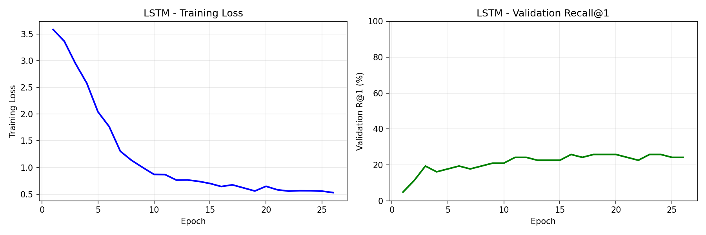
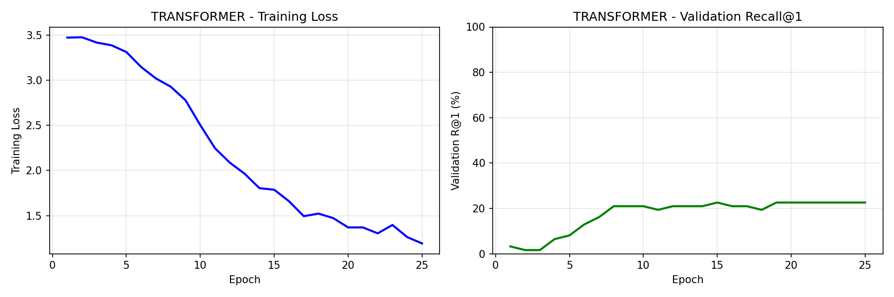
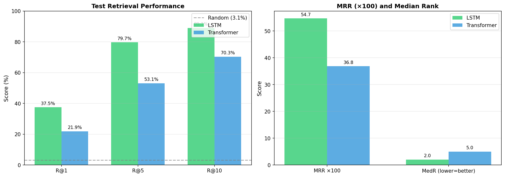
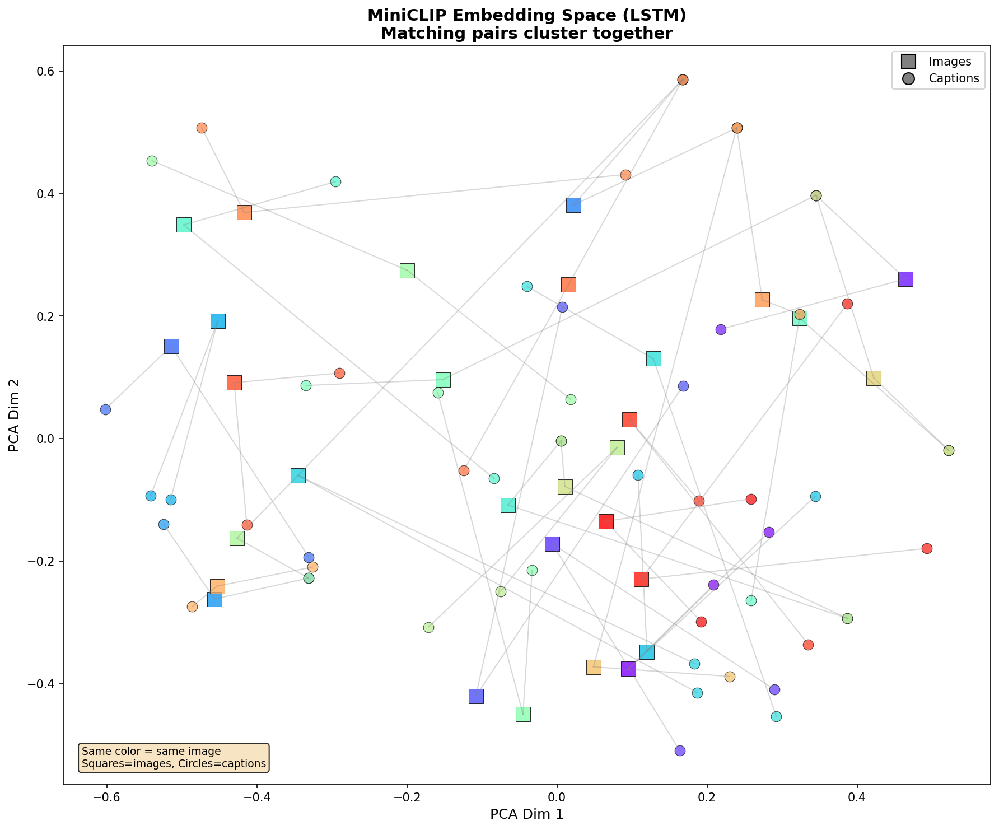
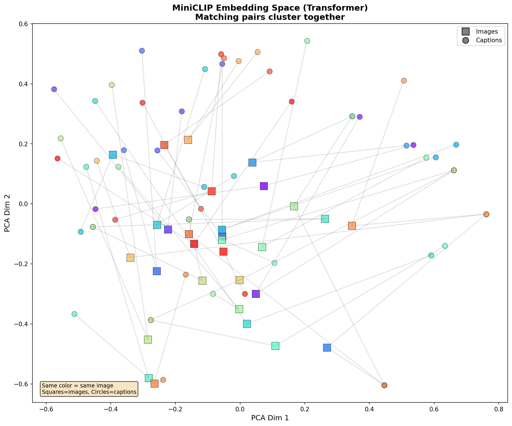
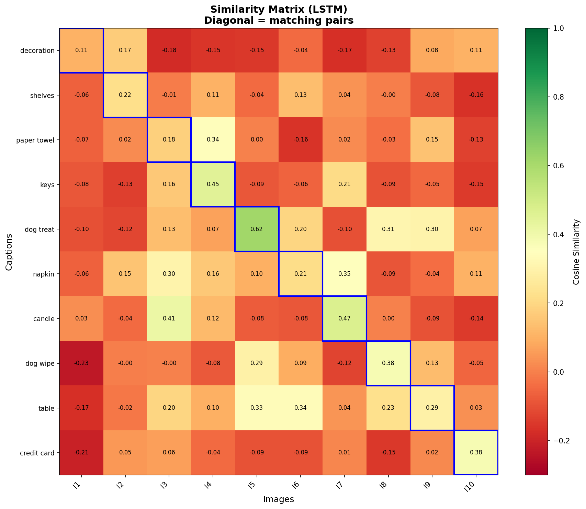
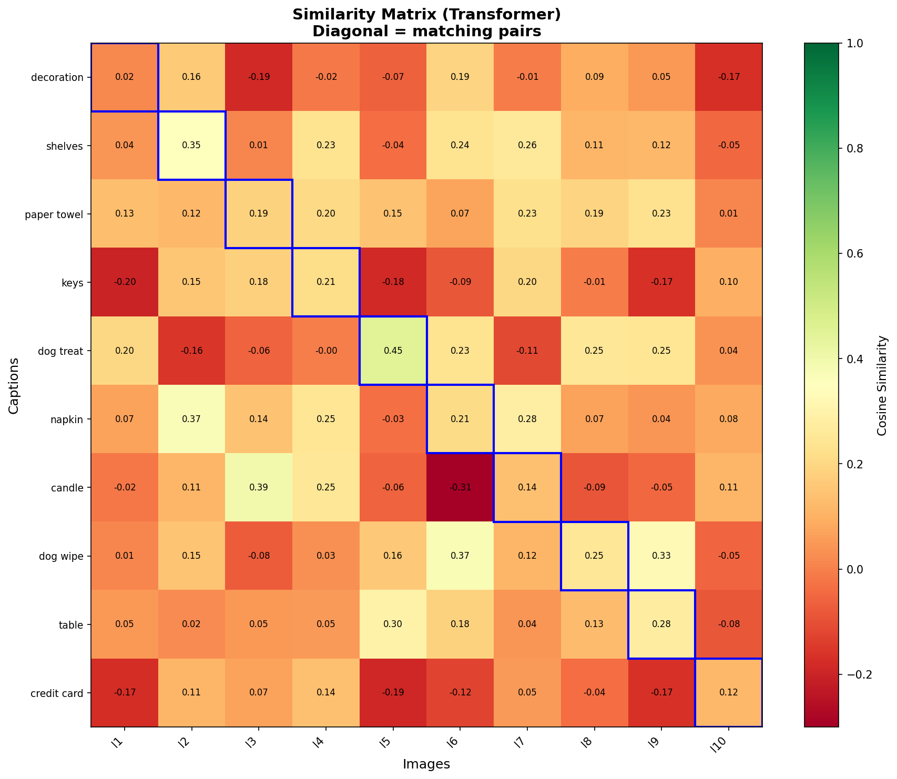
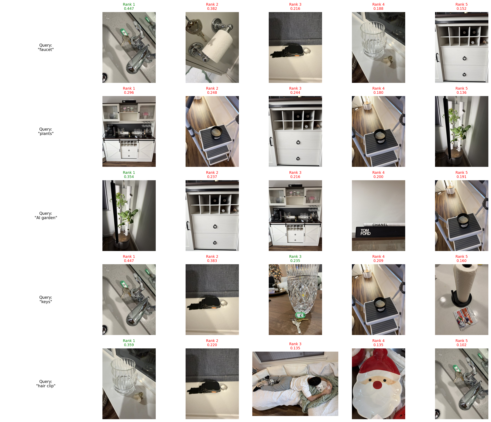
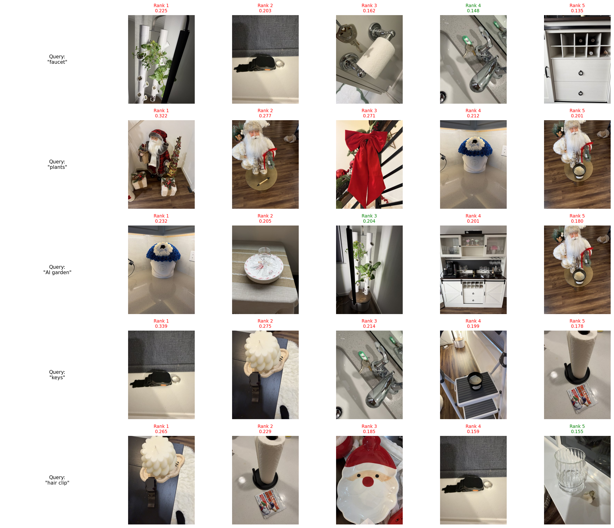

# MiniCLIP: Text-Image Retrieval for Everyday Photos

**Author**: Soroush Raeisian  
**Course**: EE P 596 Au 25: Practical introduction to Deep Learning Applications and Theory 
**Date**: autumn 2025

# 

A PyTorch implementation of CLIP-style contrastive learning for image-text retrieval on personal photo collections. This project implements a simplified version of CLIP model, enabling natural language search over image datasets.

## Project Overview

MiniCLIP learns a joint embedding space for images and text captions using contrastive learning. Given a text query like "christmas tree" or "white chair", the model retrieves the most relevant images from the dataset.

### Problem Statement
- Search personal photos with natural language queries
- Example: "white chair by window" → retrieve matching image

### Approach
- Map images and captions into a shared embedding space
- Compare BiLSTM baseline vs tiny Transformer text encoders
- Use InfoNCE contrastive loss with learnable temperature

## Dataset

| Property | Value |
|----------|-------|
| Total Images | ~210 personal photos |
| Captions per Image | 2 |
| Total Pairs | 420 image-text pairs |
| Caption Length | 2-5 words each |
| Scenes | Desk, kitchen, living room, outdoor |

### Data Split (by image, not caption)
- **Train**: 70% (147 images, 294 captions)
- **Validation**: 15% (31 images, 62 captions)
- **Test**: 15% (32 images, 64 captions)

**Note**: Same image never appears in both train and test → prevents data leakage

## Model Architecture

### Image Encoder
- **Backbone**: ResNet-18 with pretrained ImageNet weights
- **Transfer Learning**: Freeze early layers (good for small datasets)
- **Projection**: MLP to 256-dimensional embedding

### Text Encoders

#### BiLSTM Encoder
- Bidirectional: reads left→right AND right→left
- 2 layers, hidden dimension 256
- Word embedding: 128 dimensions
- Output: concatenated forward and backward hidden states

#### Transformer Encoder
- 2-layer Transformer with 4 attention heads
- Sinusoidal positional encoding
- CLS token for sequence representation
- Pre-LayerNorm for training stability

### Contrastive Loss (InfoNCE)
- Creates B×B similarity matrix for batch of B pairs
- Diagonal = correct pairs, Off-diagonal = negatives
- Symmetric loss: image-to-text + text-to-image
- Learnable temperature τ (initialized at 0.07)


## Results

### Test Set Performance

| Model | R@1 | R@5 | R@10 | MRR | MedR |
|-------|-----|-----|------|-----|------|
| **BiLSTM** | **37.50%** | **79.69%** | **89.06%** | **0.547** | **2.0** |
| Transformer | 21.88% | 53.12% | 70.31% | 0.368 | 5.0 |
| BoW Baseline | 9.38% | 20.31% | 26.56% | 0.162 | - |
| Random Baseline | 3.12% | 15.62% | 31.25% | 0.127 | - |

### Key Findings
- **BiLSTM achieves 12× improvement over random baseline**
- BiLSTM beats Transformer (37.5% vs 21.9% R@1)
- Large gap at R@5: 79.7% vs 53.1%
- MedR=2 means correct image usually in top 2!

### Metrics Explained
- **R@k**: Correct image in top k results (higher = better)
- **MedR**: Median rank of correct image (lower = better)
- **MRR**: Mean Reciprocal Rank (higher = better)

### Why BiLSTM > Transformer?
- BiLSTM has built-in sequential inductive bias
- Transformer must learn positions from scratch
- With only 210 images + short captions, BiLSTM wins
- More data would likely help Transformer catch up

### Visualizations

#### Training Curves



#### Model Comparison


#### Embedding Space Analysis


#### Similarity Matrix


#### Retrieval Examples


## 🚀 Setup Instructions

### Prerequisites
- Python 3.8 or higher
- CUDA-capable GPU (optional, but recommended)

### Installation

1. **Clone the repository**
```bash
git clone https://github.com/yourusername/miniclip.git
cd miniclip
```

2. **Create virtual environment** (recommended)
```bash
python -m venv venv
source venv/bin/activate  # On Windows: venv\Scripts\activate
```

3. **Install dependencies**
```bash
pip install -r requirements.txt
```

4. **Download pre-trained models**

Download the model weights and place them in `checkpoints/`:

📥 **[Download Pre-trained Models (Google Drive)](https://drive.google.com/drive/folders/1yLb_3cQ5vGcfsbCwhPTvmY2QOovYccp_?usp=drive_link)**

5. **Prepare your data**

Place images in `data/images/` and captions in `data/captions.json`:
```json
[
  {"file_name": "image_1.jpg", "caption": "white chair on dark hardwood floor"},
  {"file_name": "image_1.jpg", "caption": "dining chair on dark hardwood floor"},
  {"file_name": "image_2.jpg", "caption": "mug on white chair"}
]
```

## 🎮 How to Run

### Train a Model
```bash
cd src
python main.py --model_type lstm --epochs 50
python main.py --model_type transformer --epochs 50
```

### Training Options
| Argument | Default | Description |
|----------|---------|-------------|
| `--model_type` | lstm | Text encoder: 'lstm' or 'transformer' |
| `--epochs` | 50 | Number of training epochs |
| `--batch_size` | 32 | Batch size |
| `--lr` | 3e-4 | Learning rate |
| `--captions_json` | data/captions.json | Path to captions |
| `--image_root` | data/images/ | Path to images |

### Run the Demo
```bash
cd demo
python demo.py --model_type lstm           # Interactive mode
python demo.py --model_type lstm --batch   # Batch demo
```

### Expected Output
```
🔍 Query: christmas tree
📸 Top 5 results:
   1. image_4.jpg (score: 0.425)
   2. image_5.jpg (score: 0.365)
   3. image_6.jpg (score: 0.287)
```

## 📁 Project Structure

```
miniclip/
├── README.md                 # This file
├── requirements.txt          # Python dependencies
├── src/
│   ├── config.py            # Configuration and hyperparameters
│   ├── model.py             # Model definitions (MiniCLIP, encoders)
│   ├── utils.py             # Utilities (tokenizer, dataset, metrics)
│   └── main.py              # Training script entry point
├── demo/
│   └── demo.py              # Interactive demo script
├── data/
│   ├── images/              # Image files
│   └── captions.json        # Image captions
├── checkpoints/             # Saved model weights
│   ├── best_model_lstm.pth
│   └── best_model_transformer.pth
└── results/                 # Generated results
    ├── training_curves_lstm.png
    ├── training_curves_transformer.png
    ├── similarity_heatmap_lstm.png
    ├── similarity_heatmap_transformer.png
    ├── embedding_space_lstm.png
    ├── embedding_space_transformer.png
    ├── retrieval_results_lstm.png
    ├── retrieval_results_transformer.png
    ├── model_comparison.png
    ├── metrics_lstm.json
    └── metrics_transformer.json
```

## ⚙️ Configuration

All hyperparameters in `src/config.py`:

| Parameter | Value | Description |
|-----------|-------|-------------|
| `IMAGE_SIZE` | 224 | Input image size |
| `MAX_SEQ_LEN` | 32 | Maximum caption length |
| `MAX_VOCAB_SIZE` | 5000 | Maximum vocabulary size |
| `BATCH_SIZE` | 32 | Training batch size |
| `NUM_EPOCHS` | 50 | Maximum training epochs |
| `LEARNING_RATE` | 3e-4 | AdamW learning rate |
| `EMBED_DIM` | 256 | Joint embedding dimension |
| `DROPOUT` | 0.2 | Dropout probability |
| `PATIENCE` | 10 | Early stopping patience |

## 🔬 Technical Details

### Training Strategy
- **Optimizer**: AdamW with weight decay (1e-4)
- **LR Schedule**: Cosine annealing with 5-epoch warmup
- **Gradient Clipping**: Max norm 1.0
- **Early Stopping**: Patience of 10 epochs

### Training Results
| Model | Best Epoch | Final Loss | Best Val R@1 |
|-------|------------|------------|--------------|
| BiLSTM | 16 | 0.53 | 25.8% |
| Transformer | 15 | 1.19 | 22.6% |

## 💡 Challenges & Future Work

### Challenges
- Small dataset (210 images)
- Ambiguous captions (multiple "mug" images)
- Hard cases: tiny objects, similar backgrounds

### Future Directions
- More images & richer captions → Transformer would improve
- Frozen CLIP text encoder + custom image encoder
- Image→text retrieval (reverse direction)

## 📚 References

1. Radford, A., et al. "Learning Transferable Visual Models From Natural Language Supervision." ICML 2021.
2. Vaswani, A., et al. "Attention Is All You Need." NeurIPS 2017.
3. He, K., et al. "Deep Residual Learning for Image Recognition." CVPR 2016.

## 📄 License

This project is for educational purposes (EEP 596 Deep Learning Final Project).
